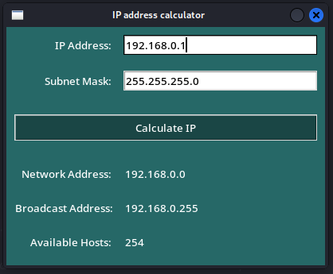

# 🌐 IP Address Calculator 🧮

A simple and intuitive IP address calculator built with Tkinter in Python. Enter an IP address and subnet mask (in decimal or CIDR format) to quickly calculate the network address, broadcast address, and the number of available hosts. Great for networking students, system administrators, and anyone working with IP addressing! 🚀

[](https://github.com/szymon-tulodziecki/IP_CALCULATOR_TKINTER)
[](https://github.com/szymon-tulodziecki/IP_CALCULATOR_TKINTER)
[](LICENSE)
[](https://www.python.org/)

## ✨ Features

*   **User-Friendly Interface:** Clean and intuitive GUI created with Tkinter. 🖼️
*   **IP Address Input:** Enter any valid IPv4 address. ⌨️
*   **Subnet Mask Input:** Supports both decimal (e.g., 255.255.255.0) and CIDR (e.g., /24) formats. 🔢
*   **Real-time Calculations:** Automatically calculates and displays the network address, broadcast address, and available hosts. ⏱️
*   **Input Validation:** Prevents invalid IP addresses and subnet masks from being entered. ✅
*   **Error Handling:** Displays informative error messages for invalid input. ⚠️

## 📸 Screenshots

Behold the IP Address Calculator in action:

   
   

## ⚙️ Requirements

*   Python 3.x
*   Tkinter (usually included with Python)
*   `ipaddress` module (built-in in Python 3.3 and later)
*   `re` module (built-in)

## ⬇️ Installation

1.  Clone the repository:

    ```
    git clone https://github.com/YourUsername/IP-Calculator.git
    cd IP-Calculator
    ```

2.  *(Optional)* Create a virtual environment:

    ```
    python3 -m venv venv
    source venv/bin/activate  # Linux/macOS
    .\venv\Scripts\activate  # Windows
    ```

3.  Install dependencies (if any, but `ipaddress` is usually built-in):

    ```
    pip install -r requirements.txt
    ```

## 💻 Usage

1.  Run the script:

    ```
    python ip_calculator_tkinter.py
    ```

2.  Enter the IP address and subnet mask in the appropriate fields.

3.  Click the "Calculate IP" button to view the results.

## 🗂️ File Structure

*   `ip_calculator_tkinter.py`: The main Python script containing the Tkinter GUI and IP calculation logic. 🐍
*   `requirements.txt`: *(Optional)*  A list of Python packages required to run the application (may be empty if no external dependencies are needed). 📄
*   `LICENSE`: The MIT license file. 📜
*   `README.md`: This file, containing information about the project. 📝

## 🔑 Key Code Snippets

*   **IP Calculation:**

    ```
    import ipaddress
    net = ipaddress.IPv4Network(f"{ip}/{mask}", strict=False)
    network_address = str(net.network_address)
    broadcast_address = str(net.broadcast_address)
    available_hosts = net.num_addresses - 2 if net.num_addresses > 2 else 0
    ```

    This code snippet uses the `ipaddress` module to calculate the network address, broadcast address, and the number of available hosts.
*   **Input Validation:**

    ```
    import re
    def validate_ip(ip):
        pattern = re.compile(r"^(25[0-5]|2[0-4][0-9]|[1]?[0-9][0-9]?)\."
                             r"(25[0-5]|2[0-4][0-9]|[1]?[0-9][0-9]?)\."
                             r"(25[0-5]|2[0-4][0-9]|[1]?[0-9][0-9]?)\."
                             r"(25[0-5]|2[0-4][0-9]|[1]?[0-9][0-9]?)$")
        return pattern.match(ip) is not None
    ```

    This function validates the IP address using a regular expression.
*   **Tkinter GUI Initialization:**

    ```
    main_window = tk.Tk()
    main_window.title("IP address calculator")
    main_window.geometry("400x300")
    main_window.resizable(False, False)
    ```

    This code initializes the main Tkinter window and sets its properties.

## 🎨 Customization

*   **Colors:** Modify the `bg_color` and `text_color` variables in the `main_window()` function to change the application's appearance.
*   **Fonts:** Customize the font styles for labels and buttons to suit your preferences.
*   **Layout:** Adjust the grid layout of widgets to create a different arrangement.

## 🤝 Contributing

Contributions are welcome! If you find a bug or have an idea for a new feature, please submit an issue or a pull request.

## 📜 License

This project is licensed under the [MIT License](LICENSE). See the `LICENSE` file for more details.
